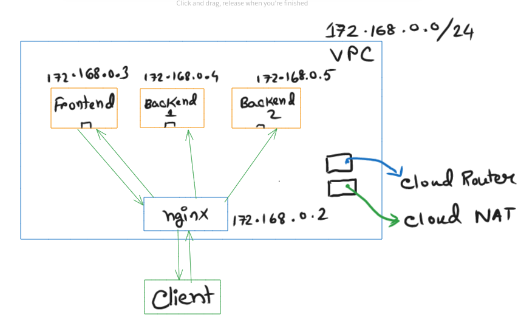
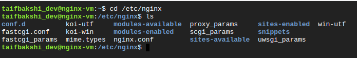
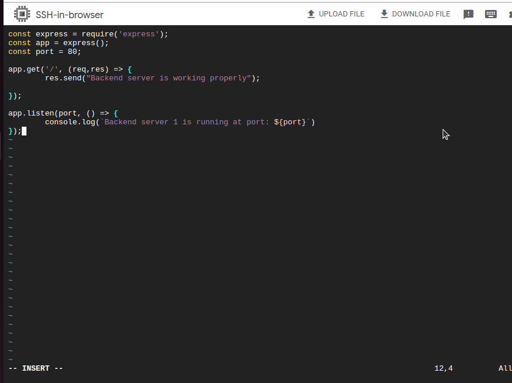
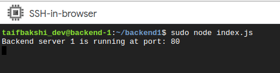

# multi-vm-deployment-in-gcp
The repo shows how to deploy a multi-vm full-stack application in Google Cloud Platform (GCP 🚀) under the same VPC (Virtual Private ☁️). We establish nginx which will act as both a load balancer and a reverse proxy. Only one VM should have public IP and other three VMs will not contain any public IP. For Egress communication they should use cloud NAT coupled with a cloud Router. The following diagram (Figure 1) shows that architecture.

 
<figure>
<figcaption align = "center">Fig.1 - A schematic representation of the demo</figcaption></figure>
 

### Step 1 | Create a VPC
Go to VPC network and create a VPC with the following configurations: 
Name: deployment-vpc 
region: us-east1  
IP stack type: IPv4 (single stack) 
IPv4 range: 172.168.0.0/24  
Firewalls: Allow all firewall rules  

Now create the VPC.
  

### Step 2 | Create 4 Virtual Machines

Remember that, the VM responsible for load-balancing shall have both public and private IPs, whereas, the other three VMs will not have any public IP. They will communicate either through the load balancer or for egress communication they will use Cloud NAT and Cloud Router. But let's create the VMs first so that we get to know the private IPs.

i) For load-balancer VM configuration:
 
VM name: nginx-vm
region: us-east1
Access Scope: allow default access
Firewall: Allow Http, Https
Advanced > network > new network interfaces: 
network - deployment-vpc  
Subnetwork - deployment-subnet
Primary Internal address: Ephemeral
Externam IPv4 Address: Ephemeral

Create the VM.

ii) other three VM's configurations are quite similar. So I will rush through them:
For frontend,  
name: frontend-vm
firewall: allow all firewalls
network: deployment-vpc
subnet: deployment-subnet
private IP: Ephemeral
public IP: None

Create VM.

Similarly create VMs for backend1 and backend 2.

In the end we will have VMs with the following IPs (In our case):

nginx-vm: 172.168.0.2(private ip) and 104.196.59.74 (public ip)   
frontend-vm: 172.168.0.3  
backend1-vm: 172.168.0.4  
backend2-vm: 172.168.0.5  

### Step 3 | Create Cloud Router and Cloud Nat

### Step 4 | Setup the load balancer configuration

we will now first setup reverse proxy and make it bahave like a load balancer. We have to setup nginx first. SSH into the nginx-vm.  
Run the following commands step by step:

$ sudo apt install update - y 

$ sudo apt install nginx -y 

$ sudo systemctl status nginx 
/* Should show it's running*/

Now go to your browser and search http://104.196.59.74 and it should show nginx Welcome page.

Now, let's setup nginx configurations.
in the terminal inside the nginx-vm do:
  cd /etc/nginx
  vim nginx.conf

or, you could connect you vm to your local machine VM and edit the nginx.conf file like I did.

Configuring <code>nginx</code>
 

 

### Step 5 | Setting up the frontend VM

SSH into the frontend-VM:

$ sudo su

// install nodejs

$ curl -fsSL https://deb.nodesource.com/setup_20.x

$ sudo apt-get install nodejs -y

$ node -v

$ sudo corepack enable // so that we can install yarn

$ yarn -v 

$ yarn create vite

cd vite-project (default project name)

$ yarn

$ yarn build 

$ yarn preview --host --port 80

now from browser use the load balancer public IP and we should see the front-end vite boilerplate running!

run <code>frontend</code>
 

 

### Step 6 | Setting up the backend servers

We have already configured the load balancer. However now we have to set up the apps in both servers so that the load balancer can route its requests evenly to these servers.

SSH into backend server 1:

sudo apt update -y  
sudo su  
curl -fsSL https://deb.nodesource.com/setup_19.x   
apt-get install nodejs -y  
node -v  

mkdir backend1  
cd backend1  
sudo corepack enable  
npm init -y  
yarn add express  

// now vim into index.js

express <code>backend1 app</code>
 

 

Now run the server code:  
sudo node index.js

 <code>server running</code>
 

 

  
Finally, if we follow the same steps for backend 2  VM it will run in its own server.

 
Now, if we go to the public ip of load balancer then it will take us to the frontend.
However, If we keep hitting 104.196.59.74/api, we will see that the requests are being handled by the load balancer and being routed to one of the 2 backend services

